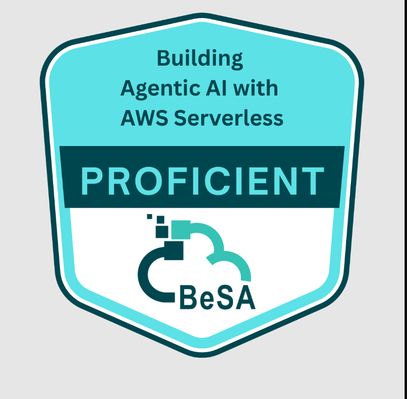

# Certification

Completed the **"Building Agentic AI architectures with AWS Serverless"** AWS Workshop Studio lab,
covering choreography and orchestration patterns for multi-agent coordination, human-in-the-loop
approval workflows, and distributed observability with CloudWatch and X-Ray.

This repository is the independent write-up of that hands-on work — see the [main README](README.md)
for the full breakdown and the [disclaimer](README.md#disclaimer) on how this relates to AWS's own
content.
