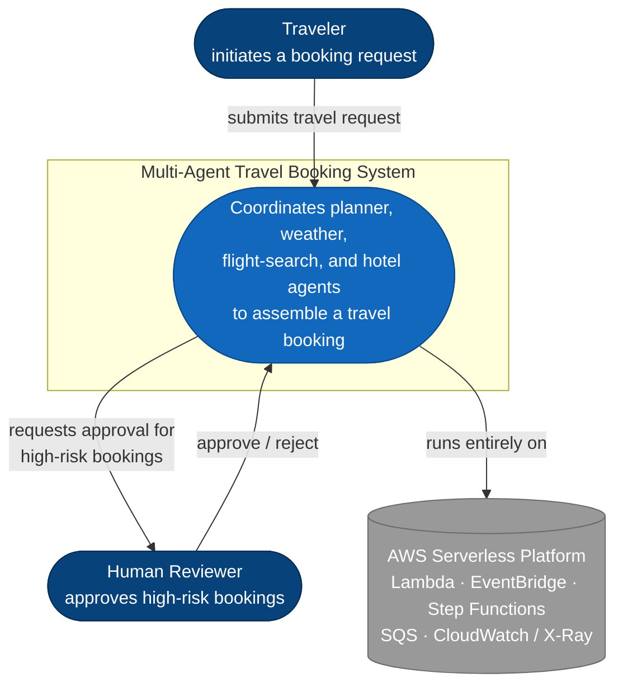
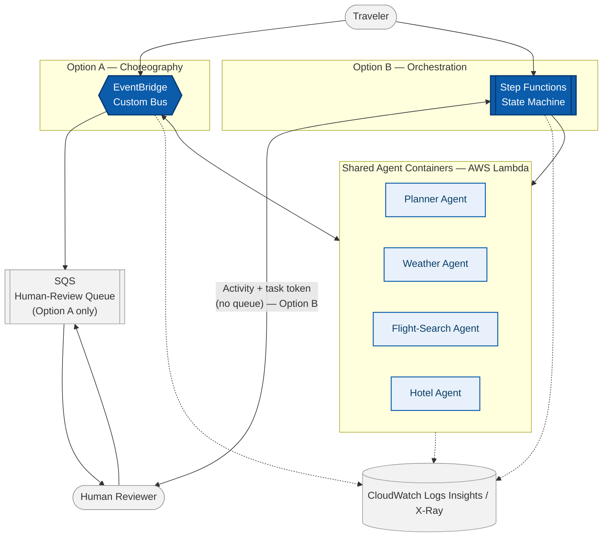

# High-Level Design — Multi-Agent Patterns on AWS Serverless

| | |
|---|---|
| **Document** | High-Level Design (HLD) |
| **System** | Multi-agent travel-booking system — reference architecture |
| **Status** | Reference architecture (educational build, not a production deployment) |
| **Version** | 1.0 |
| **Last updated** | 2026-09-04 |

## 1. Purpose

This document is the umbrella design for the whole repository. [`choreography.md`](choreography.md)
and [`orchestration.md`](orchestration.md) each go deep on *one* candidate architecture; this HLD
sits above both — it states the requirements once, evaluates the two candidates against them side
by side, and records the trade-off a real architecture review would have to make. Module-level
detail (event catalogs, execution graphs, screenshots of the deployed system) lives in
[`../docs/`](../docs); this document stays at the level a design-review board would actually read.

## 2. System overview

### 2.1 Problem statement

Synchronous, request/response agent calls don't survive contact with production: an agent that
needs real time to reason, call a slow external API, or wait on a human decision either times out
or holds serverless compute idle while it waits. This system exists to answer one question by building it twice, two different ways: **how do you
coordinate several independent AI agents asynchronously, without any single agent's latency or
failure blocking the rest?**

### 2.2 Goals

- Decompose a travel-booking workflow into independent, single-purpose agents (planner, weather,
  flight-search, and — added later — hotel recommendations).
- Support two coordination strategies for the same problem domain and make their trade-offs
  explicit rather than picking one silently.
- Require human sign-off before finalizing any high-risk or over-budget booking.
- Make any individual booking's full lifecycle reconstructable after the fact, regardless of which
  coordination strategy produced it.

### 2.3 Non-goals

- **Not** a production payment or inventory system — flight/hotel data is simulated.
- **Not** a survey of every AWS integration pattern; scope is intentionally limited to
  choreography vs. orchestration.
- **Not** covering CI/CD or infrastructure-as-code pipeline design — this repository documents the
  runtime architecture, not the delivery pipeline.

## 3. Requirements

### 3.1 Functional requirements

| ID | Requirement |
|---|---|
| FR1 | Accept a travel request and initiate the booking workflow |
| FR2 | Independently research weather conditions and flight availability for the requested dates |
| FR3 | Flag bookings that exceed budget or risk thresholds for manual review |
| FR4 | Block booking finalization until a human decision is recorded for any flagged booking |
| FR5 | Allow a new specialized agent to be added without modifying any existing agent's code |
| FR6 | Allow any individual booking's full event/step history to be reconstructed for debugging or audit |

### 3.2 Non-functional requirements

| NFR | Target / approach | Priority |
|---|---|---|
| Scalability | Fully serverless — Lambda, EventBridge, and Step Functions scale automatically; no capacity planning | High |
| Extensibility | New agents attach via event subscription without touching existing agents (see FR5) | High |
| Auditability | Every booking's full history must be reconstructable, by design, not by exception | High |
| Availability / fault isolation | One agent's failure or slowness must not block unrelated agents | Medium |
| Observability | Every event/step correlated by a shared `bookingID` across CloudWatch Logs Insights and X-Ray | High |
| Security | Least-privilege IAM role per Lambda function; no shared or long-lived credentials between agents | Medium |
| Cost efficiency | Pay-per-invocation compute only; no idle infrastructure between bookings | Medium |
| Human oversight | High-risk decisions require an explicit human approval step, not an automated override | High |

## 4. System context

## 5. Candidate architectures

Rather than presenting one final design, this system was deliberately built twice against the same
requirements in section 3 — the way an architecture review would evaluate two RFCs before picking a
direction (or a hybrid of both).

### 5.1 Option A — Choreography (Amazon EventBridge)

Agents coordinate only through events on a shared bus; no component owns the sequence. Full design:
[`choreography.md`](choreography.md).

### 5.2 Option B — Orchestration (AWS Step Functions)

A central state machine owns the sequence, branching, and retries explicitly. Full design:
[`orchestration.md`](orchestration.md).

### 5.3 Decision matrix

| Criterion | Option A — Choreography | Option B — Orchestration | Weight |
|---|---|---|---|
| Extensibility (FR5) | ✅ New agent subscribes to events; zero changes upstream (proven in [Module 04](../docs/04-extending-the-system.md)) | ⚠️ Requires editing the state machine definition | High |
| Auditability (FR6) | ⚠️ Reconstructed after the fact via `bookingID` log correlation | ✅ Native execution graph and per-step history | High |
| Fault isolation | ✅ One agent's failure doesn't directly block unrelated agents | ⚠️ Central workflow must explicitly handle every failure path | Medium |
| Human-in-the-loop wait (FR4) | ✅ Natural fit — an event + queue, no held compute | ✅ Native fit — task-token `Wait` state, no held compute | High |
| Operational visibility | ⚠️ No single "workflow" view exists; must query logs | ✅ One graph shows the entire request | Medium |
| Coordination overhead | ✅ None — agents are fully decoupled | ⚠️ Every new step is a state-machine change | Medium |

### 5.4 Recommendation

Neither option dominates the other — they optimize for opposite things, and the decision matrix
above is intentionally a wash on purpose. The recommendation this repository lands on is a
**hybrid**: use **orchestration** for the core sequence that has a genuine compliance and
auditability requirement (dates → parallel research → risk decision → human approval →
finalization), and use **choreography** for optional, plugin-style capabilities layered on top
after a booking completes — exactly the shape [Module 04](../docs/04-extending-the-system.md)
demonstrates by attaching the Hotel Agent to the choreography bus rather than the state machine.
In other words: orchestrate what must be guaranteed and audited; choreograph what should be easy to
extend.

## 6. Container-level architecture

Both options share the same agent implementations and the same human-review and observability
building blocks — the coordination layer is the only thing that changes between them.

## 7. Cross-cutting concerns

### 7.1 Event and data contracts

See the event catalog in [`choreography.md`](choreography.md#event-catalog) for the full table of
event types, producers, and consumers — that contract is what FR5 (extensibility) actually depends
on, in either option.

### 7.2 Human-in-the-loop design

Both options implement the same principle from FR4 with the tool native to each, and deliberately
not the same tool: choreography routes a flagged booking to an **SQS** review queue alongside the
`HumanReviewRequired` / `HumanApprovalDecision` events, correlated by `bookingID`; orchestration
uses a **Step Functions Activity with the `waitForTaskToken` pattern** instead — explicitly *no*
SQS queue, since the state machine can already hold a paused task open on its own. Neither approach
blocks compute while waiting. Full detail:
[`../docs/03-human-in-the-loop.md`](../docs/03-human-in-the-loop.md).

### 7.3 Observability strategy

`bookingID` is the one identifier every agent, in both options, is required to stamp onto its logs
and events — that single convention is what makes FR6 possible at all. Full detail:
[`../docs/05-observability.md`](../docs/05-observability.md).

### 7.4 Security

- Each Lambda function runs under its own least-privilege IAM execution role — no agent holds
  permissions it doesn't need for its own event source and downstream calls.
- No credentials or state are shared directly between agents; the bus and the state machine are the
  only integration surfaces.
- The human-approval step exists specifically to keep irreversible, high-consequence actions
  (booking a high-risk trip) out of fully-automated control.

### 7.5 Error handling and resilience — current gaps

This reference build does not yet close every gap a production rollout would require. Recorded
here deliberately rather than left implicit — see [section 10](#10-risks-and-mitigations).

## 8. Deployment view

- **Region:** single-region deployment (`us-west-2` in the reference build) — no cross-region
  failover.
- **Compute:** each agent (planner, weather, flight-search, hotel) is an independently deployed
  Lambda function with its own execution role and log group.
- **Coordination layer:** EventBridge custom bus (Option A) and a Step Functions standard state
  machine (Option B), deployed side by side against the same agent functions.
- **Human review:** choreography escalates through an SQS-backed review queue; orchestration
  escalates through a Step Functions Activity using the task-token pattern — no queue involved. See
  [7.2](#72-human-in-the-loop-design).
- **Observability:** CloudWatch Logs / Logs Insights for all functions, with X-Ray tracing
  available across EventBridge, Step Functions, and Lambda.

## 9. Assumptions and constraints

- Agents are implemented as Python Lambda functions targeting a single AWS account and region.
- Event and state-machine payload contracts are assumed stable for the lifetime of this reference
  build (no schema versioning is implemented yet — see risks below).
- Both options are evaluated against the same simulated travel-booking domain; conclusions about
  which pattern "wins" are scoped to systems with similar shape (short-lived agent tasks, a human
  approval gate, a need for extensibility) and shouldn't be generalized without re-checking against
  a different problem's requirements.

## 10. Risks and mitigations

| Risk | Impact | Mitigation |
|---|---|---|
| No dead-letter queues configured on EventBridge targets | A failed agent invocation can silently drop an event | Add DLQs and CloudWatch alarms to every rule target before any production use |
| Event schema drift (choreography) | A producer changing a field silently breaks consumers with no compile-time check | Version event `detail-type`s and add contract tests between producer and consumer agents |
| Human-review timeout has no escalation path | A stalled review can strand a booking indefinitely with no alert | Replace the fixed timeout with a monitored SLA and automatic escalation/alerting |
| Central state machine as a single point of workflow-definition change (orchestration) | Every new step requires editing and redeploying the state machine | Modularize with nested state machines / `Map` states as the workflow grows |
| Single-region deployment | A regional AWS outage takes the whole system down | Out of scope for this reference build; would require multi-region replication of the bus, state machine, and Lambda functions |

## 11. Future roadmap

- Add a schema registry / versioning strategy for events crossing the EventBridge bus.
- Add DLQs, retries, and alerting to every integration point identified in section 10.
- Prototype the hybrid design recommended in [5.4](#54-recommendation): orchestrate the core
  approval sequence, choreograph optional downstream agents.
- Package the deployment as infrastructure-as-code (SAM or CDK) for reproducibility — intentionally
  out of scope for this repository today.

## 12. References

- [`choreography.md`](choreography.md) · [`orchestration.md`](orchestration.md) — detailed designs
  for each option
- [`../docs/01-choreography-pattern.md`](../docs/01-choreography-pattern.md) ·
  [`../docs/02-orchestration-pattern.md`](../docs/02-orchestration-pattern.md) ·
  [`../docs/03-human-in-the-loop.md`](../docs/03-human-in-the-loop.md) ·
  [`../docs/04-extending-the-system.md`](../docs/04-extending-the-system.md) ·
  [`../docs/05-observability.md`](../docs/05-observability.md) — module-level walkthroughs with
  proof-of-work screenshots
- [`../README.md`](../README.md) — repository overview and key takeaways
