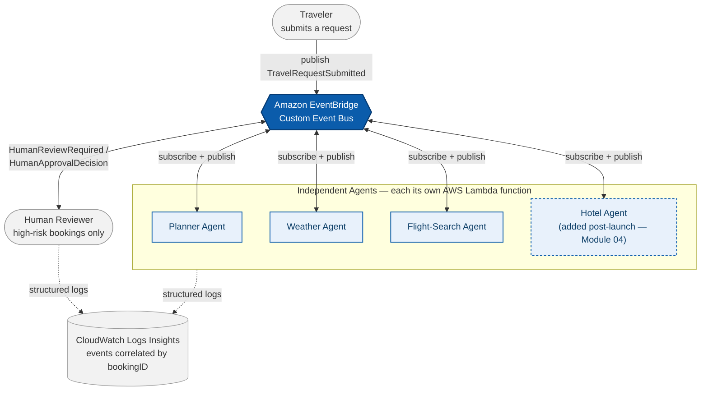

# Choreography Architecture

Agents coordinate purely through events on a shared EventBridge bus. No component owns the
sequence, and — just as importantly — **no agent ever talks to another agent directly.** Every
connection in this system is an agent to the bus. That single constraint is what the diagram below
is drawn to make obvious.

**Legend:** solid border = present from launch · dashed border = added later with zero changes to
neighboring components (Module 04) · dotted arrow = observability side-channel, not part of the
booking workflow itself.

## Event catalog

The diagram intentionally shows *only* the hub-and-spoke topology — every event actually flowing
across that bus is documented here instead, which is the same separation of concerns a real
event-driven-architecture design doc uses (topology diagram + event contract table, rather than
trying to cram both into one picture):

| Event (`detail-type`) | Producer | Consumer(s) | Purpose |
|---|---|---|---|
| `TravelRequestSubmitted` | Traveler / client | Planner Agent | Starts a new booking workflow |
| `DatesFinalized` | Planner Agent | Weather Agent, Flight-Search Agent | Confirms trip dates so both agents can research in parallel |
| `WeatherAnalysisCompleted` | Weather Agent | Planner Agent | Destination weather/risk assessment |
| `FlightSearchCompleted` | Flight-Search Agent | Planner Agent | Available flights and pricing |
| `HumanReviewRequired` | Planner Agent | Human Reviewer (via review queue) | Escalates a high-risk or over-budget booking |
| `HumanApprovalDecision` | Human Reviewer | Planner Agent | Carries the approve/reject outcome back in |
| `FinalBookingCompleted` | Planner Agent | Hotel Agent *(Module 04)* | Triggers the hotel-recommendation agent, added after launch |
| `HotelRecommendationsReady` | Hotel Agent *(Module 04)* | — *(terminal event; not currently consumed by another agent)* | Published once the hotel agent finishes and emails its recommendations |

**Correlation, not coordination.** The only thing every agent shares on the bus is the `bookingID`
carried on every event above, and there's no central agent registry — the Hotel Agent (Module 04)
is the one confirmed exception to "no shared state," since it and the Planner Agent both read from
the same S3 session store. See
[`../docs/01-choreography-pattern.md`](../docs/01-choreography-pattern.md) for the walkthrough and
[`../docs/04-extending-the-system.md`](../docs/04-extending-the-system.md) for how the Hotel Agent
was added to this exact diagram without changing anything upstream of it.
