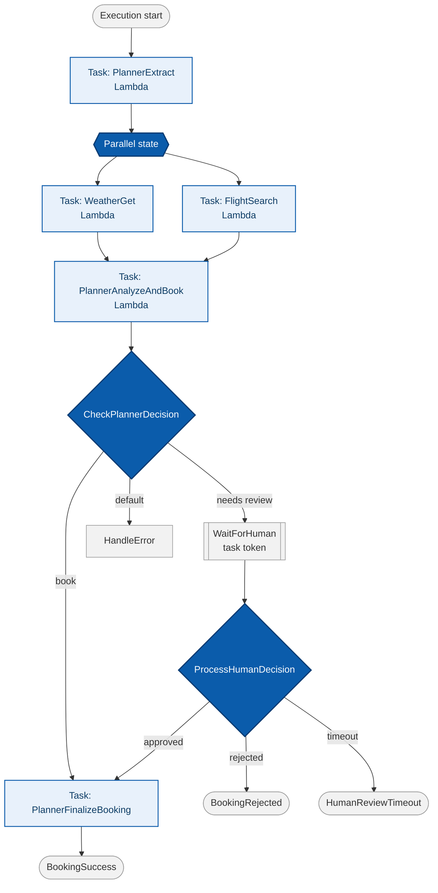

# Orchestration Architecture

A single Step Functions state machine owns the sequence. Agents still run as independent Lambda
functions, but the workflow definition — not the agents themselves — controls order, parallelism,
and branching.

**Legend:** blue diamonds/hexagons = control-flow states owned by the state machine itself (parallel
branch, choice, human wait) · light-blue boxes = `Task` states invoking an agent Lambda · grey =
terminal/pass states.

**One graph, one audit trail.** Every state's input/output is inspectable after execution, and the
human-approval branch (`WaitForHuman` / `ProcessHumanDecision`) is a structural part of the
definition rather than something reconstructed from logs. See
[`../docs/02-orchestration-pattern.md`](../docs/02-orchestration-pattern.md) for the walkthrough and
[`../docs/03-human-in-the-loop.md`](../docs/03-human-in-the-loop.md) for how the approval step
compares to choreography's approach to the same problem.
