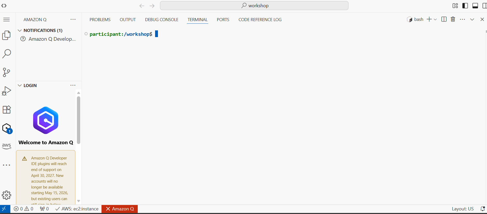
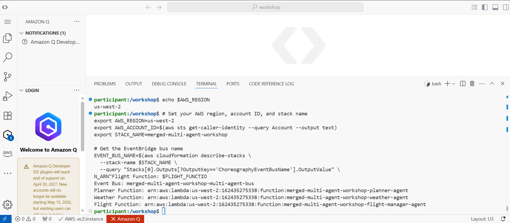
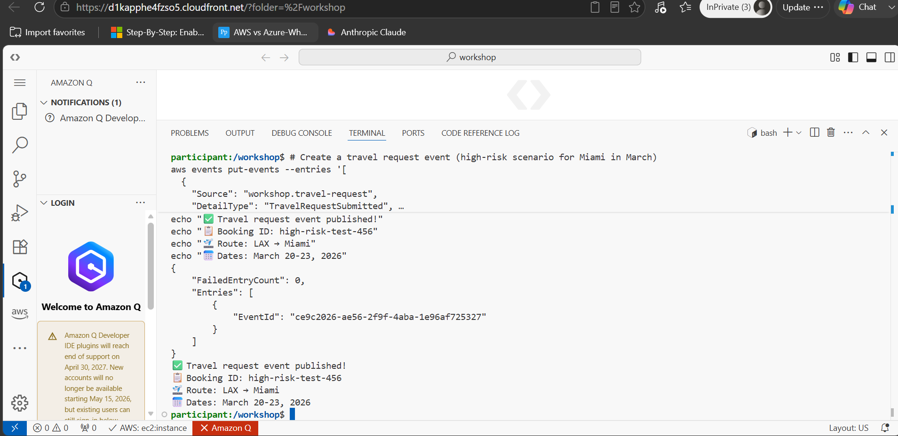
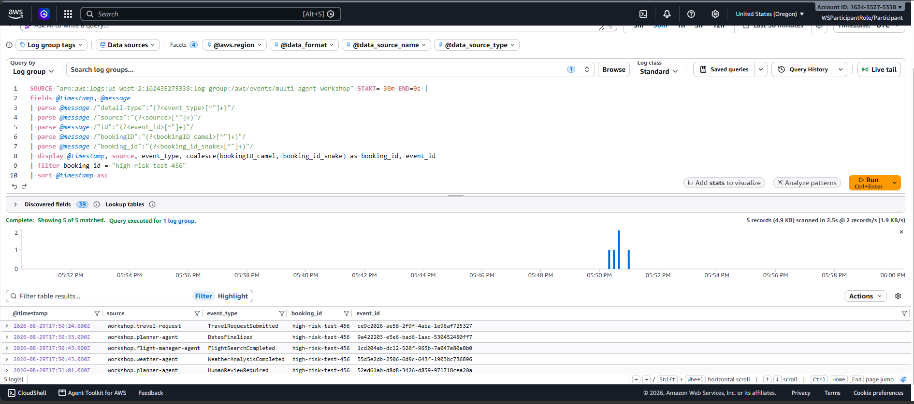

# Module 1 — Choreography Pattern

## The idea

In a choreographed design there is no central controller. Every agent listens for events it cares
about on a shared event bus, does its own work, and publishes an event describing the result. Other
agents pick that event up if it's relevant to them. No agent needs to know which other agents exist
or where they run — it only needs to know the event shape it's reacting to.

The workflow environment used throughout this project runs inside a VS Code-based IDE provisioned
for the workshop, with the AWS CLI pre-configured to the target account and region.

## Wiring agents to the event bus

Each agent (planner, weather, flight-search) is deployed as its own Lambda function and subscribed
to specific event `detail-type`s on a custom EventBridge bus. The first step is confirming which bus
the workshop stack provisioned and which Lambda ARNs are behind it, since that's what ties the
choreography together:

## Keeping agents correlated without coupling them

The one thing every agent *does* share for coordination is a `bookingID` on every event it publishes
and consumes — there's no central agent registry, and no agent needs to know another exists to react
to its events. (The Hotel Agent added in [module 04](04-extending-the-system.md) is the one
exception on the *state* side: it shares an S3 session store with the Planner Agent, though that's a
read/write convenience between two specific agents, not a system-wide coordination mechanism.) A new
travel request is published as an ordinary `PutEvents` call:

From there, each agent picks up the events it's subscribed to, does its work, and emits its own
event — `DatesFinalized`, `FlightSearchCompleted`, `WeatherAnalysisCompleted`, and so on — all
carrying the same `bookingID` forward.

## Watching the choreography play out

Because there's no single place that "runs" the workflow, the only way to see the whole picture is
to query the logs for every event carrying a given `bookingID`. Doing that in CloudWatch Logs
Insights turned this into a readable timeline of independent agents reacting to each other:

## Why this pattern is worth it

The payoff is extensibility: because agents only depend on event shapes and not on each other,
adding a brand-new agent to this system later (see
[module 04](04-extending-the-system.md)) required zero changes to any of the agents already running.
The cost is that there's no built-in way to answer "where is this booking right now?" — you have to
reconstruct that from the event log, which is why the observability work in
[module 05](05-observability.md) matters as much as the pattern itself.
