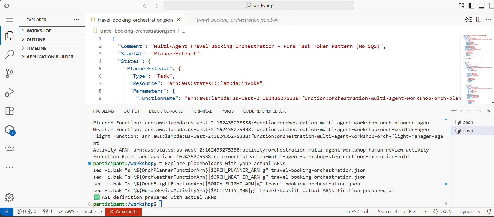
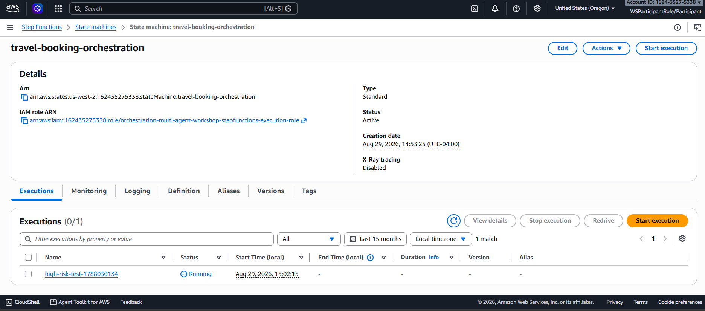
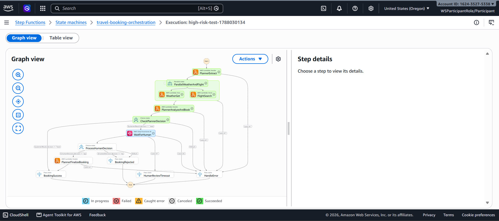
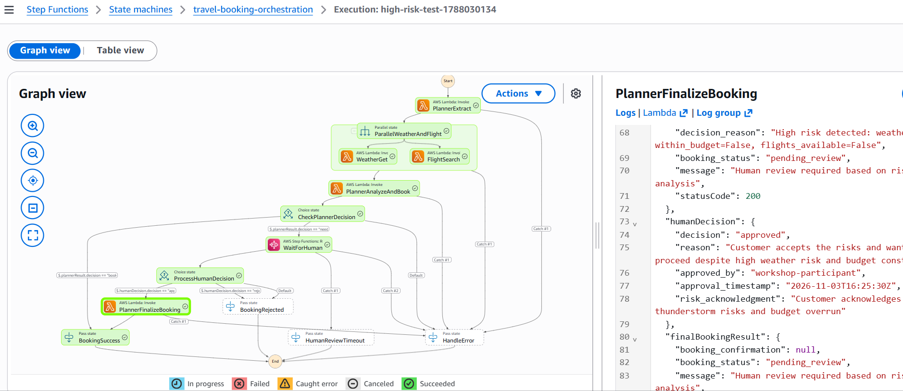

# Module 2 - Orchestration Pattern

## The idea

In an orchestrated design, one central workflow owns the sequence. Each agent still runs
independently as its own Lambda function, but the execution order, branching, parallelism, and
error handling are all explicitly defined in a state machine rather than left to implicit event
subscriptions. On AWS, that role belongs to **Step Functions** - it owns retries, state, and
decision logic as first-class parts of the workflow definition instead of scattered agent-side
logic.

## Defining the state machine

The travel-booking workflow is expressed as an Amazon States Language (ASL) definition: extract the
request, run weather and flight search in parallel, have the planner analyze the combined result,
branch on risk level, and - for anything flagged high-risk - pause for a human decision before
finalizing or rejecting the booking. The definition itself is explicit about how that pause works -
its own `Comment` field describes it as a **"Pure Task Token Pattern (No SQS)"**: the human-review
wait is a Step Functions Activity holding a task token, not a queue. That's a deliberate contrast
with choreography's SQS-backed review queue - see [module 03](03-human-in-the-loop.md) for both
sides of that comparison. Deploying the state machine means resolving its placeholder ARNs against
the actual Lambda functions and IAM role created for this stack:

Once deployed, the state machine appears as a first-class resource in the Step Functions console,
ready to accept executions:

## Running an execution

Starting an execution with a high-risk test booking (a Miami trip that fails both the weather and
budget checks) drives the state machine through its parallel branches - `WeatherGet` and
`FlightSearch` run concurrently, then feed into the planner's analysis step:

## Where orchestration earns its keep

The real difference from choreography shows up here: every state transition is visible in one
graph, and every step's input/output is inspectable after the fact. When the planner flags a
booking as high-risk, the state machine explicitly transitions into a `WaitForHuman` state - that
branch point is a property of the workflow definition, not something reconstructed after the fact
from a stream of events. Once a human decision comes back approved, the graph shows exactly which
path was taken and why:

That step-level detail panel is the trade-off made explicit: orchestration costs you the loose
coupling of choreography, but buys back a built-in, auditable answer to "what happened, in what
order, and why" - see [module 03](03-human-in-the-loop.md) for how that specific decision point
works, and [module 05](05-observability.md) for how this compares to choreography's log-based
approach to the same problem.
