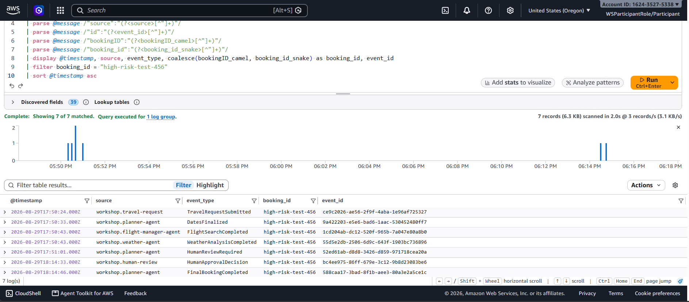

# Module 3 - Human-in-the-Loop Approval

## Why not every decision should be automated

An agent that books a $5,000 flight because the numbers technically clear a threshold is a
liability, not a feature. Some decisions - high-risk bookings, budget overruns, anything with real
financial or safety consequences - need a human to explicitly sign off before the system proceeds.
Building that in as a first-class workflow state, rather than bolting on a manual check afterward,
is what makes the system trustworthy enough to actually deploy.

## How it shows up in each pattern

**Orchestration** (Step Functions) makes this the most explicit: the state machine has a dedicated
`WaitForHuman` state that the workflow transitions into whenever the planner's risk analysis calls
for it, and a `ProcessHumanDecision` choice state that branches into finalize, reject, or timeout
based on what comes back - see [module 02](02-orchestration-pattern.md) for the full graph.

**Choreography** handles the same requirement through the event stream itself: a
`HumanReviewRequired` event is published like any other agent event and routed to an SQS review
queue, and - once a decision is made - a `HumanApprovalDecision` event carries the outcome forward,
keeping the same `bookingID` correlation the rest of the system relies on. Orchestration's approach
is deliberately not this: see [module 02](02-orchestration-pattern.md#where-orchestration-earns-its-keep)
for why the state machine uses a Step Functions Activity and task token instead of a queue.

## Tracing an approval end to end

Querying CloudWatch Logs Insights for a single `bookingID` shows the full approval lifecycle in the
choreography pattern: the request comes in, the planner and weather/flight agents do their work,
the system decides the booking needs human review, and - after a decision is recorded - the
booking is finalized:

## What this buys you

A workflow that can pause indefinitely for a human decision - without holding compute, a connection,
or a timeout window open - is exactly the kind of thing synchronous request/response architectures
handle badly. Both patterns here solve it the same underlying way: persist the "waiting" state
(as a Step Functions task token or an event correlated by booking ID) and resume asynchronously when
the decision arrives, rather than blocking anything while waiting on a person.
