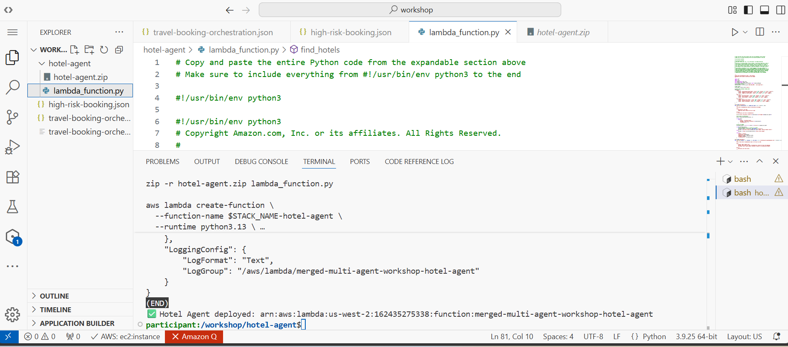
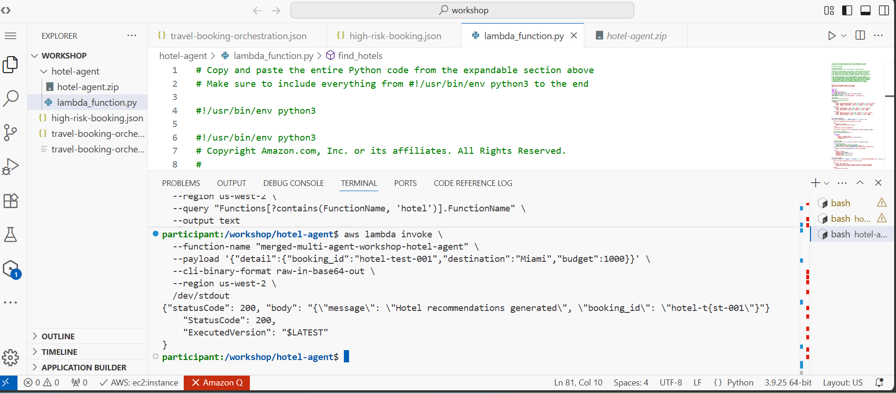
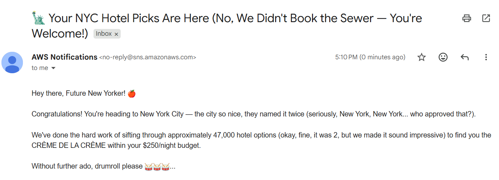

# Module 4 - Extending the System

## The test: add a capability without touching existing code

The real test of a loosely-coupled architecture isn't how it looks on day one - it's what happens
when a new requirement shows up later. This module adds a **Hotel Recommendation agent** to the
choreography pattern from [module 01](01-choreography-pattern.md): it listens for completed
bookings and suggests hotels based on destination and budget, with zero changes to the planner,
weather, or flight-search agents already running.

## Building and deploying the new agent

The new agent is a standalone Lambda function, packaged and deployed the same way every other agent
in the system was - no central registry to update, just a function that knows which event to listen
for. It's a genuine agent, not a plain handler: it runs on the **Strands Agents SDK** against a
Bedrock-hosted Claude model, with a system prompt built to give it a distinct persona (a witty,
joke-cracking hotel concierge - see the email it sends in the next section), and it shares an S3
session store with the planner agent so it can pick up the same booking context. See
[`../code/agents/hotel-agent/lambda_function.py`](../code/agents/hotel-agent/lambda_function.py)
for the actual source, recovered from the workshop:

## Verifying it works in isolation

Before wiring it into the live event flow, invoking the function directly with a sample booking
confirms it produces recommendations correctly:

## Seeing it in the real flow

Once subscribed to the event bus, the hotel agent reacts to a real completed booking the same way
every other agent does - no different from how the flight-search or weather agent picks up its
events. The end result reaches the traveler as a notification:

## Why this matters more than it looks

This is the concrete payoff of choreography's loose coupling described in
[module 01](01-choreography-pattern.md): the existing agents never had to be redeployed, their code
never changed, and there was no central workflow definition to edit. The new agent simply started
existing and reacting to events that were already flowing through the system. That's the trade
choreography makes on purpose - you give up the single-graph visibility that orchestration provides
in exchange for a system that grows by addition instead of modification.
