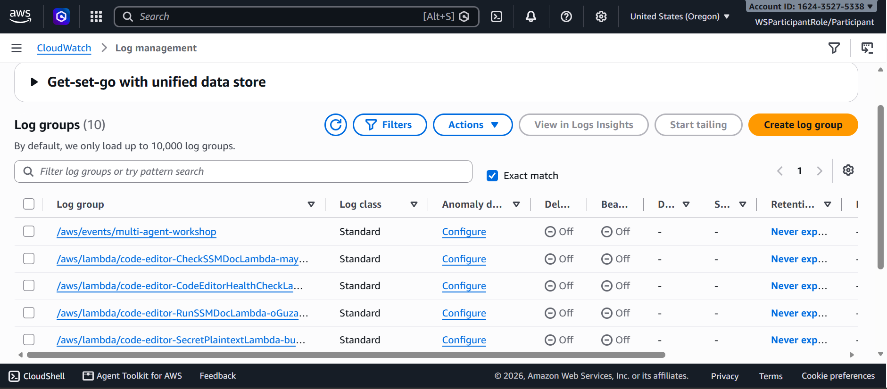

# Module 5 — Observability

## Why this is a separate concern, not an afterthought

Choreography and orchestration solve *coordination*. Neither one, by itself, answers "why did this
specific booking fail, and where in the system did it fail?" That's an observability problem, and it
has to be designed in deliberately — especially in choreography, where there's no central log of
"what happened" to fall back on.

## The starting point: knowing what's actually running

Every agent Lambda function logs to its own CloudWatch log group by default. Before you can trace
anything meaningful, you need visibility into what log groups even exist for the deployed stack:

## The pattern that makes tracing possible: correlation by booking ID

The single design decision that made this system debuggable was making every agent, in both
patterns, stamp its events and logs with the same `bookingID`. That turns "what happened to this
request" from a distributed-systems problem into a single filtered query. In CloudWatch Logs
Insights, parsing the log message for `bookingID` and filtering on one value reconstructs the full
timeline of a request as it moved through independent, decoupled agents:

The same query, re-run after a booking has gone through human review, shows the complete lifecycle
including the approval step — see [module 03](03-human-in-the-loop.md) for what that decision point
represents:

## Choreography vs. orchestration, from an observability angle

- **Orchestration** gives you this almost for free: the Step Functions execution graph *is* the
  trace, with every state transition and its input/output already correlated and visualized (see
  [module 02](02-orchestration-pattern.md)).
- **Choreography** gives you none of that automatically — the event bus doesn't know a "workflow"
  exists. The correlation ID convention above is what makes it possible to reconstruct the same
  picture after the fact, at the cost of having to actively query for it rather than opening a
  pre-built graph.

That gap is worth calling out explicitly: choosing choreography for its extensibility means
explicitly budgeting for the observability work to compensate, not assuming it comes for free the
way it does with a state machine.
